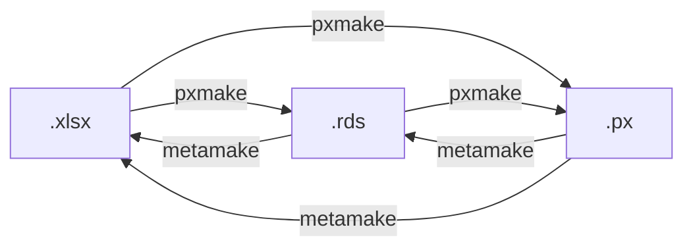

# pxmake


Functions and templates to convert a tidy dataset into a PX file, combining necessary metadata of both technical and informational kind to data.

## Installation

Install the latest version by running:

``` r
# install.packages('devtools')
devtools::install_github('StatisticsGreenland/pxmake')
```

'pxmake' is not available on CRAN.

## How to use

### Data formats

`pxmake` and `metamake` can convert between `.xlsx` files (Excel), `.rds` (data frames), and `.px` files.



When `pxmake` convert directly from `.xlsx` to `.px` it gives the same result as first converting from `.xlsx` to `.rds` and then from `.rds` to `.px`. So in the example below `example1.px` and `example2.px` are identical.

``` r
# From .xlsx to .px
pxmake(input = "example.xlsx", out_path = "example1.px")
```

``` r
# From .xlsx to .rds to .px
pxmake(input = "example.xlsx", out_path = "example.rds")
pxmake(input = "exmaple.rds",  out_path = "example2.px")
```

#### Bulk updates

This makes it possible to do modifications to the `.rds` file before converting to `.px`. In some cases this can be useful to do bulk modifications on the `.rds` files, rather than manually doing the changes in the `.xlsx` files.

``` r
# Update contact info in all .xlsx file in directory
library(pxmake)
library(tidyverse)

# List all xlsx files in directory
xlsx_files <- list.files(pattern="*.xlsx")

# Create rds file names by replacing file extension
rds_files  <- str_replace(xlsx_files, ".xlsx$", ".rds")

# Run pxmake on all xlsx_files
map2(xlsx_files, rds_files, pxmake)

# Define function to set a new value for a keyword and overwrite the rds file
update_keyword_value <- function(rds_path, keyword_name, new_value) {
  rds <- readRDS(rds_path)
  
  rds$metadata <- 
    rds$metadata %>%  
    dplyr::mutate(value = ifelse(keyword == keyword_name,
                                 new_value,
                                 value
                                 )
                  )
  
  saveRDS(rds, rds_path)
}

# Run the update functino on all rds files to set a new email address under CONTACT
walk(rds_files, function(x) update_keyword_value(x, 
                                                 keyword_name = 'CONTACT', 
                                                 new_value = "new@contact.com"
                                                 )
     )
```

After updating, the rds files can be converted to `.px` by running `pxmake` on the new rds files:

``` r
px_files <- str_replace(xlsx_files, ".xlsx$", ".px")
map2(rds_files, px_files, pxmake)
```

or you can use `metamake` to convert the `.rds` files back to `.xlsx` so the contact information is updated there:

``` r
map2(rds_files, xlsx_files, metamake)
```

## For developers

### PX specification

See the [PX-file format specification on Statistics Swedens homepage](https://www.scb.se/globalassets/vara-tjanster/px-programmen/px-file_format_specification_2013.pdf).

### PxJob

Some tests cases uses [PxJob](https://www.stat.fi/tup/tilastotietokannat/px-tuoteperhe_en.html). Install [pxjob64Win](https://github.com/StatisticsGreenland/pxjob64Win) to be able ro run these tests. This only works on Windows.

### How to create a new release

1.  Checkout 'main' branch.
2.  Run `usethis::use_version('major'/'minor'/'patch')`. Answer 'No' to the prompt 'Is it ok to commit them?'.
3.  Update NEWS.md with all changes since last release.
4.  Commit changes with message 'Increment version number to X.Y.Z'.
5.  Run `git tag vX.Y.Z`.
6.  Run `git push`.
7.  Run `git push --tags`.
8.  Run `devtools::use_github_release()`.
9.  Review relase description. If sattified, click the 'edit' pen in the upper right corner.
10. Click 'Publish release'.
11. Run `usethis::use_version('dev')`. Answer 'Yes' to the prompt 'Is it ok to commit them?'.
12. Run `git push`.
