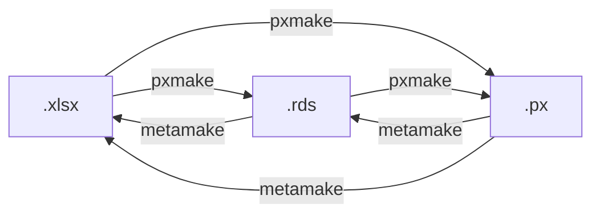

# pxmake


Functions and templates to convert a tidy dataset into a PX file, combining necessary metadata of both technical and informational kind to data.

## Installation

Install the latest release of 'pxmake' by running:

```r
# install.packages('devtools')
# Latest release
devtools::install_github('StatisticsGreenland/pxmake/@*release')
```

Install the development version by running:

```r
# install.packages('devtools')
# Development version
devtools::install_github('StatisticsGreenland/pxmake')
```

'pxmake' is not available on CRAN.

## PX specification

See the [PX-file format specification on Statistics Swedens homepage](https://www.scb.se/globalassets/vara-tjanster/px-programmen/px-file_format_specification_2013.pdf).

## Data formats
`pxmake` and `metamake` can convert between Excel files, `.rds` (data frame), and `.px` files.



Which file type is converted from and to is determined by the file extension in the paths provided to `pxmake` and `metamake`. 

When converting directly from `.xlsx` to `.px`, `pxmake` internally first converts to `.rds` and then to `.px`. Therefore


```r
pxmake(metadata = "example.xlsx", out_path = "example.px")
```

is equivalent to

```r
pxmake(metadata = "example.xlsx", out_path = "example.rds")
pxmake(metadata = "exmaple.rds",  out_path = "example.px")
```

It's also possible to make modifications to the `.rds` file before converting it to `.px`. This allows for bulk modifications of multiple `.rds` files.

```r
pxmake('table1.xlsx', 'table1.rds')
pxmake('table2.xlsx', 'table2.rds')
pxmake('table3.xlsx', 'table3.rds')

# Modify .rds datasæt

readRDS('table.rds') %>% 
  mutate(value = ifelse(keyword == "CONTACT" & language == "en",
                        "johan@ejstrud.com",
                        value
                        ),
         ) %>% 
  saveRDS('table.rds')

pxmake('table.rds', 'metdata.xlsx')

metame('table.px', 'metadata.xlsx')
```

## For developers

### PxJob
Some tests cases uses [PxJob](https://www.stat.fi/tup/tilastotietokannat/px-tuoteperhe_en.html). Install [pxjob64Win](https://github.com/StatisticsGreenland/pxjob64Win) to be able ro run these tests. This only works on Windows.

### How to create a new release
1. Checkout 'main' branch.
1. Run `usethis::use_version('major'/'minor'/'patch')`. Answer 'No' to the prompt 'Is it ok to commit them?'.
1. Update NEWS.md with all changes since last release.
1. Commit changes with message 'Increment version number to X.Y.Z'.
1. Run `git tag vX.Y.Z`.
1. Run `git push`.
1. Run `git push --tags`.
1. Run `devtools::use_github_release()`.
1. Review relase description. If sattified, click the 'edit' pen in the upper right corner.
1. Click 'Publish release'.
1. Run `usethis::use_version('dev')`. Answer 'Yes' to the prompt 'Is it ok to commit them?'.
1. Run `git push`.
